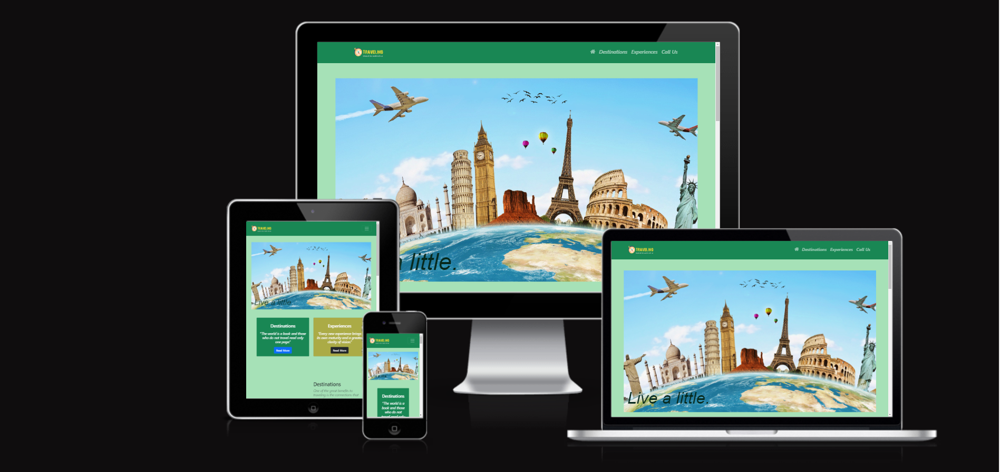

<h1 align="center">Travelino</h1>
[View the live project here.](https://rustam-aliyev889.github.io/Travelino/index.html)
<h2 align="center"></h2>

# What the Project is about? 
This is a website for a travel agency. It allows you to book a holiday or event. There is a contact page for visitors to the website to contact the agency .

Altogether there are 4 web pages.

## User Experience (UX)

-   ### User stories

    -   #### First Time Visitor Goals

        1. As a First Time Visitor, I want to be able to navigate to the different sections of the website to gain a basic knowledge of services the company offers and how it helps me. 
        2. As a First Time Visitor, I want to be able to contact the company.
        3. As a First Time Visitor, I want to be able to find the office address so in case I want to do it in person. 
    
     

     

    -   #### Returning Visitor Goals

        1. As a Returning Visitor, I want them to use the booking function on the website to book their own service.
        2. As a Returning Visitor, I want them to learn in details about the provided services.
        3. As a Returning Visitor, I want them to see values of the company. 
   
     

     

    -   #### Frequent User Goals
        1. As a Frequent User, I want them to book every service through the contact form or a phone. 
        2. As a Frequent User, I want them to make contact with us through the website about any issues or ways we can help them.
        3. As a Frequent User, I want them to agree to our monthly phone calls about our special deals which are unique for every client. 

     

# Web pages
## Home page(index.html)
The Home page is the landing page which introduces the website to the visitor and introduces the services of the company with links to other pages.
## Destinations
This web page allows you to see what kind of holiday you can expect in addition you can fimiliarize yourself with the article which explains the reasons why you should travel.
## expiriences
This web page allows you to see what kind of event or experience  you can participate in. Furthemore you can fimiliarize yourself with the article which explains the benefits of Benefits Of trying New Things.
## Contact us(form.html)
The contact us page provides the user with a form to capture the name and email of anyone wishing to contact us. The form uaes the POST method for security so that the user's details are not made visible in the URL

# Design 
The interface consists of Wireframes – 3 wireframes for each page – (one for each of PC size, Ipad, Smartphone ) – The files are included named as follows:
|Web page| File name|
| ------ | ------ |
|   Home page    |   index.html         |
|   Destinations |   Destinations.html      |
|   Expiriences  |   Expiriences.html       |
|   contact us   |   form.html        | 

## PC

  

## Tablet

  

## Phone

  

# Resources  
## images
https://www.freewebheaders.com/sport/sports-1024x300/gallery/page/1
## graphics
Logo - create at logoza.com using the online logo maker

# Technologies
HTML
CSS
Bootstrap library used for styling all pages
Font-awesome

# Testing

## Language validation
The W3C Markup Validator and W3C CSS Validator Services were used to validate every page of the project to ensure there were no syntax errors in the project. 

  

-   [W3C Markup Validator](https://validator.w3.org/nu/?doc=https%3A%2F%2Frustam-aliyev889.github.io%2FTravelino%2Findex.html) - Results - No Errors or Warnings
-   [W3C Markup Validator](https://validator.w3.org/nu/?doc=https%3A%2F%2Frustam-aliyev889.github.io%2FTravelino%2Fdestinations.html) - Results - No Errors or Warnings
-   [W3C Markup Validator](https://validator.w3.org/nu/?doc=https%3A%2F%2Frustam-aliyev889.github.io%2FTravelino%2Fexperiences.html) - Results - No Errors or Warnings
-   [W3C Markup Validator](https://validator.w3.org/nu/?doc=https%3A%2F%2Frustam-aliyev889.github.io%2FTravelino%2Fform.html) - Results - No Errors or Warnings 

 

-   [W3C CSS Validator](https://jigsaw.w3.org/css-validator/validator?uri=https%3A%2F%2Frustam-aliyev889.github.io%2FTravelino%2Findex.html&profile=css3svg&usermedium=all&warning=1&vextwarning=&lang=en) - Results No Errors 

-   [Lighthouse reports]:

### index.html
  

### destinations.html
  

### experiences.html
  

### form.html
  

## Testing web page  links
|Test Case| Test|Expected Outcome|Actual Outcome|Comment|
| ------ | ------ |------ |------ |------ |
|1|   Home page links  functional test    |  launch home page        |All links launched home page|n/a|
|2|  Destinations links functional test     | launch Current computer games page          |all links launched Destinations page|n/a|
|3|  Expiriences links funtional test for all pages    |   launch About us page        |All links launched |n/a|
|4| Contact us links functional tests for all pages     | launch Contact us page          |All links launched correctly|n/a|

# Bugs
|Bug|Comment|
| ------ | ------ |
|Pages were not linked correctly as they were linking to the wrong pages or didn't work at all|This was corrected and recorded in the Test log|
|Font size wasn't responsive |Code was included to correct it. Subsequent test verified correct operation of the timer|
|Elements were not centered correctly|This was fixed and tested to ensure it works|
|Images were distorted on mobile devices|This was fixed and tested to ensure it works|

## Responsive testing
|Test Case| Test|Expected Outcome|Actual Outcome|Comment|
| ------ | ------ |------ |------ |------ |
|1|   Smartphone display test    |  website should display with no distortions        |Website displayed with no distortions|n/a|
|2|  Tablet display test. The website will be tested using an Ipad to represent the most common tables     | All webpages should display with no distortion          |All pages displayed correctly|n/a|
|3|  Display test for all pages on a Desktop computer    |   All web pages should display with no distortion |All pages displayed correctly|n/a|

## Browser support testing
The following web browsers were used to test the display of the website including the functionality of the contact us form
###### Safari
###### Edge
###### Chrome
###### Opera

## Deployment

### Where can it be found on GitHub? 
The GitHub link for the project is - https://github.com/Rustam-Aliyev889/Travelino.git

### GitHub Pages

I deployed the project onto GitHub Pages using the following steps:

1. Go to my GitHub repository for the project this is the link. [My GitHub Repository for Travelino](https://github.com/Rustam-Aliyev889/Travelino)
2. Locate the 'Settings' button for the repository and click.
3. Scroll down the Settings page until you see the "Pages" Section on your left.
4. You need to change the "Source", by clicking the dropdown and choose "deploy from a branch".
5. You then need to change branch from 'None' to 'main'.
7. The page will automatically refresh.
7. At the top of the 'Pages' section, look to locate the now published site [link](https://rustam-aliyev889.github.io/Travelino/index.html).

## Contributing

Pull requests are welcome. For major changes, please open an issue first
to discuss what you would like to change.

Please make sure to update tests as appropriate.